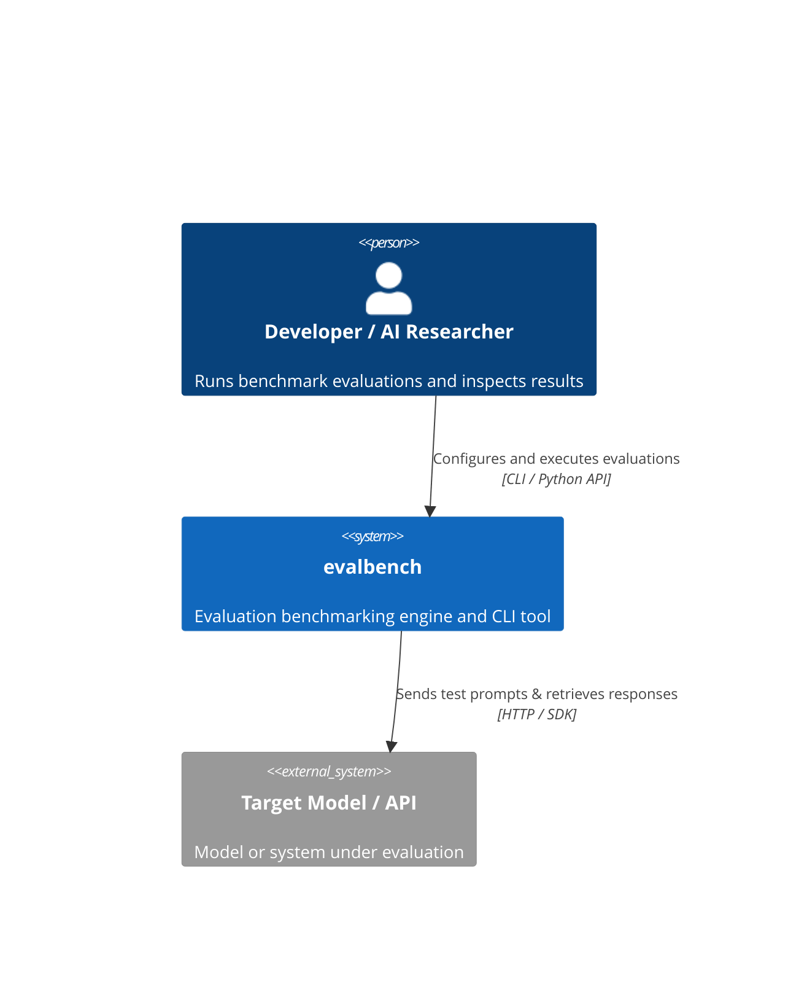
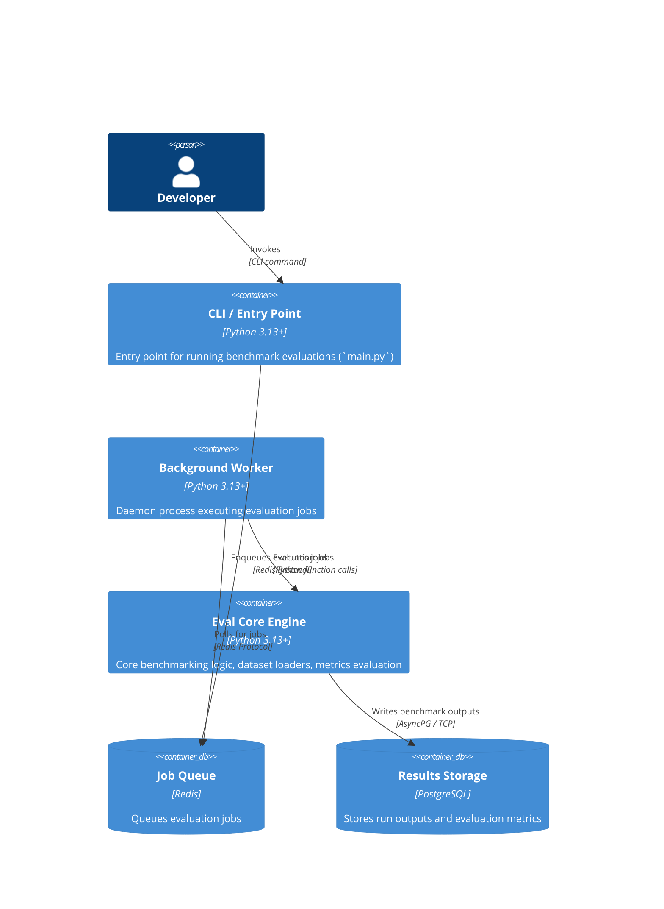
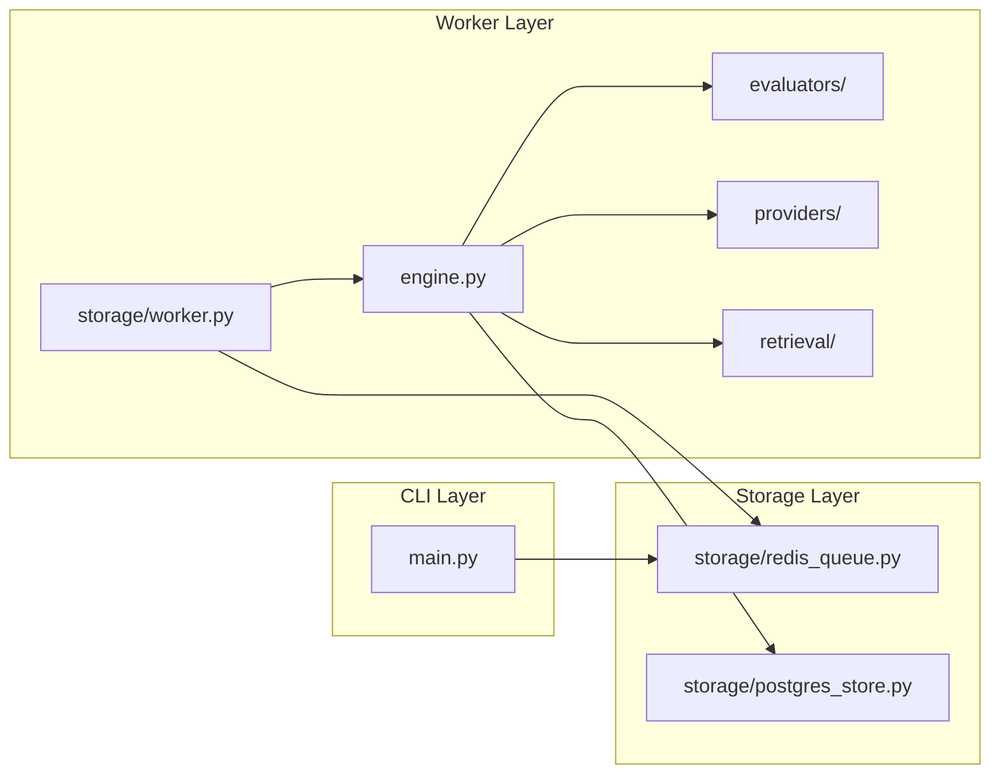

# Architecture — evalbench

> **Last updated:** 2026-08-24  
> **Authors:** evalbench team  
> **Status:** Draft  

## Overview

`evalbench` is a Python-based evaluation benchmark toolkit designed for AI models and workflows. It supports async distributed execution using a background worker architecture.

---

## Level 1 — System Context

**External dependencies:**

| System | Purpose | Owner | SLA |
| --- | --- | --- | --- |
| Target LLM APIs | Model inference execution (OpenAI, Anthropic, Gemini, etc.) | External Providers | Dependent on provider |
| PostgreSQL Database | Results and evaluation metrics storage | Local/Infrastructure | High |
| Redis Server | Job queue broker | Local/Infrastructure | High |

---

## Level 2 — Containers

**Container inventory:**

| Container | Technology | Responsibility | Scales |
| --- | --- | --- | --- |
| CLI / Entry Point | Python 3.13+ | Command-line parsing and enqueueing jobs | Local execution |
| Background Worker | Python 3.13+ | Pulls jobs from queue and executes | Horizontal (Multi-process) |
| Eval Core Engine | Python 3.13+ | Benchmark execution, providers, evaluators | Within worker |
| Job Queue | Redis | Buffering and distributing jobs | Redis cluster |
| Results Storage | PostgreSQL | Metric results and trace output persistence | Postgres cluster |

---

## Level 3 — Components

### evalbench — Components

---

## Key Architectural Decisions

- **Python 3.13+ runtime** — Takes advantage of modern Python features and performance improvements.
- **Async Execution** — Heavy use of `asyncio` for scalable LLM API calls via `asyncpg`.
- **Redis + Worker Queue** — Migrated from synchronous execution to a distributed queue to support large-scale dataset evaluations.
- **PostgreSQL Storage** — Selected for robust relational metric storage and querying over flat files.

---

## Data Flow — Key Scenarios

### Benchmark Execution Flow

`Developer → main.py (Enqueue) → Redis (Queue) → Worker (Dequeue) → EvalEngine → Target LLM API → Postgres (Store Results)`

---

## Infrastructure

| Environment | Platform | Region | Notes |
| --- | --- | --- | --- |
| Local dev | Python 3.13 venv | Local machine | Uses `.venv` |
| Local services | Redis + PostgreSQL | Local machine | Requires external daemon processes |

---

## Non-Functional Characteristics

| Property | Target | Current |
| --- | --- | --- |
| Python Version | >= 3.13 | 3.13 |
| Execution Parallelism | Distributed queue / Async workers | Redis-backed workers |

---

## Related Documents

- [README](README.md)
- [CONTEXT](CONTEXT.md)
- [PRD](docs/prd.md)
