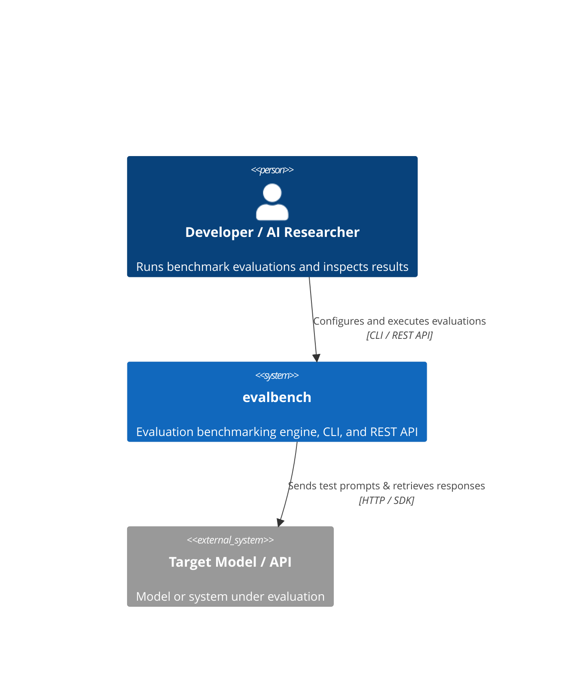
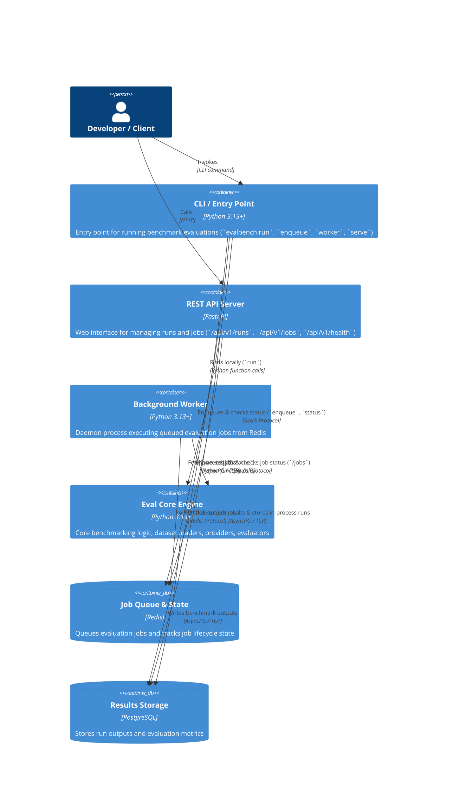
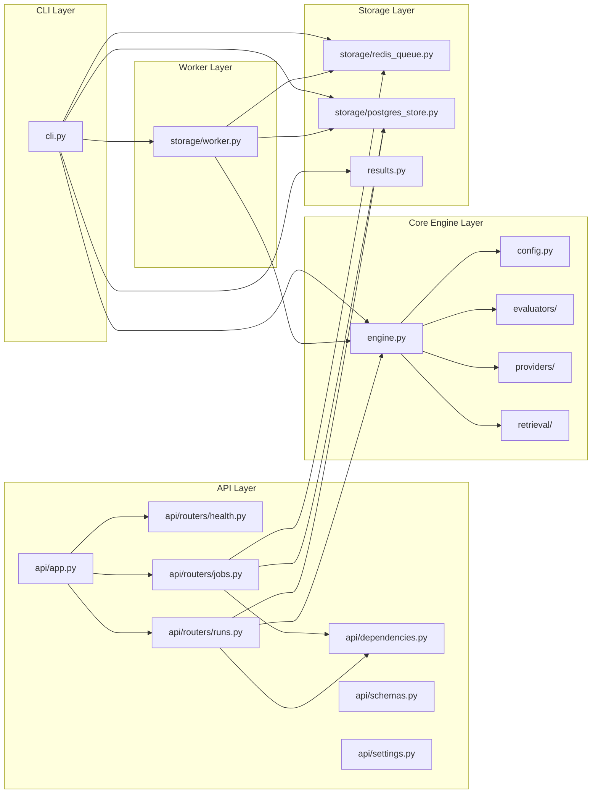

# Architecture — evalbench

> **Last updated:** 2026-08-28  
> **Authors:** evalbench team  
> **Status:** Active  

## Overview

`evalbench` is a Python-based evaluation benchmark toolkit designed for AI models and workflows. It supports async distributed execution using a background worker architecture as well as standalone CLI execution and REST API endpoints.

---

## Level 1 — System Context

**External dependencies:**

| System | Purpose | Owner | SLA |
| --- | --- | --- | --- |
| Target LLM APIs | Model inference execution (OpenAI, Anthropic, Gemini, etc.) | External Providers | Dependent on provider |
| PostgreSQL Database | Results and evaluation metrics storage | Local/Infrastructure | High |
| Redis Server | Job queue broker and status tracking | Local/Infrastructure | High |

---

## Level 2 — Containers

**Container inventory:**

| Container | Technology | Responsibility | Scales |
| --- | --- | --- | --- |
| CLI / Entry Point | Python 3.13+ | Runs local evaluations, enqueues jobs, checks status, and runs worker daemon | Local execution |
| REST API Server | FastAPI / Uvicorn | Web endpoints for health, direct runs, and async job management | Local/Horizontal |
| Background Worker | Python 3.13+ | Pulls jobs from Redis queue, runs evaluations, and records completion | Horizontal (Multi-process) |
| Eval Core Engine | Python 3.13+ | Benchmark execution, provider abstraction, evaluator scoring, retrieval | Within worker / CLI / API |
| Job Queue & State | Redis | Buffering queued jobs and recording per-job status metadata | Redis cluster |
| Results Storage | PostgreSQL | Metric results and trace output persistence | Postgres cluster |

---

## Level 3 — Components

### evalbench — Components

---

## Key Architectural Decisions

- **Python 3.13+ runtime** — Takes advantage of modern Python features, PEP 604 type unions, and performance improvements ([ADR 002](docs/adr/002-use-pydantic-for-core-schemas.md)).
- **Async Execution** — Heavy use of `asyncio` for scalable LLM API calls, Redis polling, and `asyncpg` connection pooling.
- **Local CLI Execution** — CLI evaluations run locally via asyncio and output to JSONL, allowing quick iteration without external services ([ADR 003](docs/adr/003-use-jsonl-for-dataset-storage.md)).
- **FastAPI Layer** — Exposes REST endpoints with in-process background task execution for lightweight runs and Redis job routing for heavy workloads ([ADR 004](docs/adr/004-fastapi-and-background-tasks-for-api-layer.md)).
- **Redis Queue + Postgres Results Separation** — Transient job queue lifecycle state is isolated in Redis while long-term evaluation metrics and traces reside in PostgreSQL ([ADR 005](docs/adr/005-transient-redis-queue-and-postgres-result-separation.md)).

---

## Data Flow — Key Scenarios

### 1. Local Benchmark Execution (CLI)

`Developer → evalbench run <config> → EvalEngine → Target LLM API → JSONLResultStore (Local)`

### 2. Distributed Benchmark Execution (Worker)

`Developer → evalbench enqueue <config> → RedisQueue (Enqueue) → Worker (Dequeue) → EvalEngine → Target LLM API → PostgresStore (Store Results)`  
`Developer → evalbench status <job_id> → RedisQueue + PostgresStore (Read)`

### 3. API Direct In-Process Run

`Client → POST /api/v1/runs → BackgroundTasks → EvalEngine → Target LLM API → PostgresStore`  
`Client → GET /api/v1/runs/{run_id} → PostgresStore`

### 4. API Distributed Job Queue

`Client → POST /api/v1/jobs → RedisJobQueue (Enqueue)`  
`Worker → RedisJobQueue (Dequeue) → EvalEngine → PostgresStore (Save Run)`  
`Client → GET /api/v1/jobs/{job_id} → RedisJobQueue (Check Status)`  
`Client → GET /api/v1/jobs/{job_id}/results → PostgresStore (Fetch Run Summary)`

---

## Infrastructure

| Environment | Platform | Region | Notes |
| --- | --- | --- | --- |
| Local dev | Python 3.13 venv | Local machine | Uses `.venv` managed with `uv` |
| Local services | Redis + PostgreSQL | Local machine | Required for distributed execution and API job storage |

---

## Non-Functional Characteristics

| Property | Target | Current |
| --- | --- | --- |
| Python Version | >= 3.13 | 3.13 |
| Execution Parallelism | Distributed queue / Async workers | Redis-backed workers (`evalbench worker`) |
| API Scalability | Async non-blocking endpoints | FastAPI + AsyncPG connection pool |

---

## Related Documents

- [README](README.md)
- [CONTEXT](CONTEXT.md)
- [PRD](docs/prd.md)
- [ADRs](docs/adr/)
- [Concepts](docs/concepts/)
- [How-To Guides](docs/how-tos/)
- [Runbooks](docs/runbooks/)
