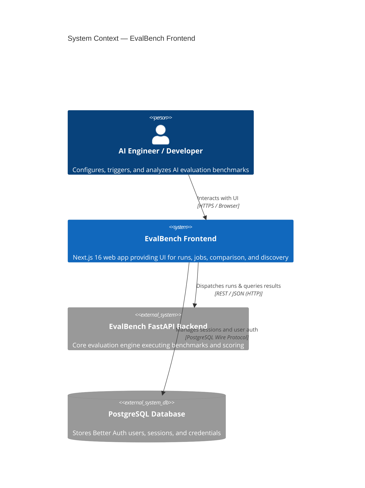
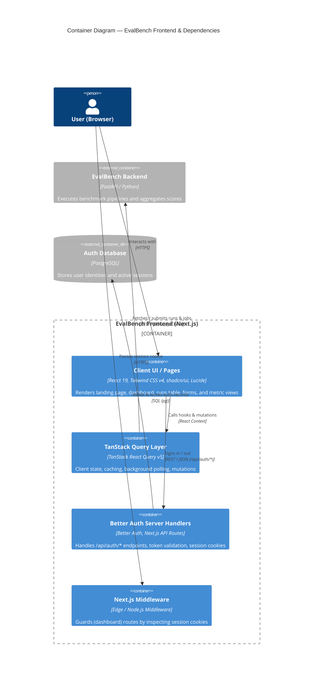
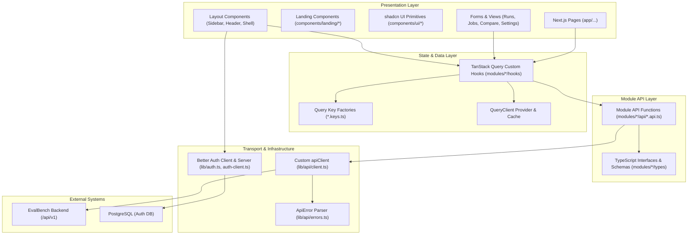
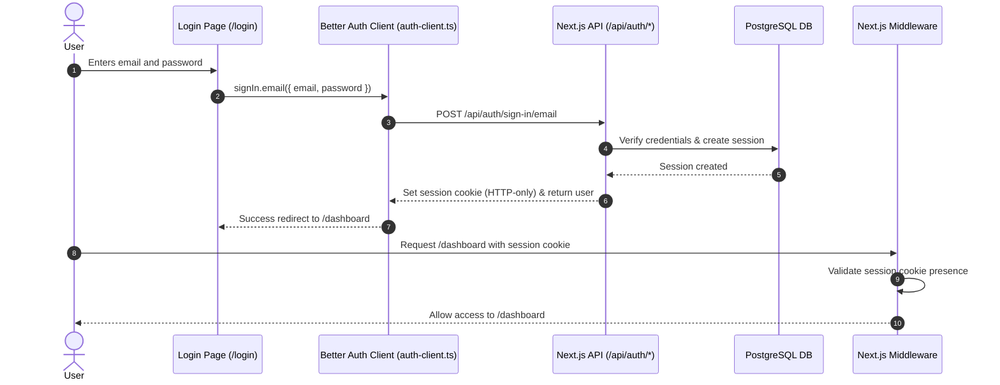
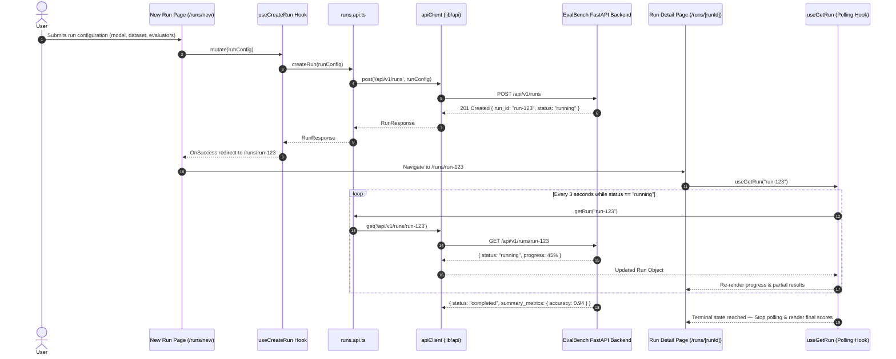

# Architecture — EvalBench Frontend

> **Last updated:** 2026-09-02  
> **Authors:** EvalBench Engineering Team  
> **Status:** Current

---

## Overview

EvalBench Frontend is a Next.js 16 web application that provides a comprehensive public landing page and an intuitive graphical dashboard for the EvalBench AI evaluation and benchmarking platform. It enables AI engineers and developers to configure evaluation runs across diverse LLM providers, monitor asynchronous execution in real time, inspect granular test case outputs and metrics, and compare model benchmarks side-by-side. The frontend interacts directly with the EvalBench FastAPI backend (`/api/v1/*`) and implements user session management via Better Auth.

---

## Level 1 — System Context

The EvalBench Frontend serves as the user-facing entry point for managing and visualizing AI benchmarks, coordinating between end users, the EvalBench execution backend, and authentication storage.

### External Dependencies

| System | Purpose | Communication | SLA / Availability |
| :--- | :--- | :--- | :--- |
| **EvalBench FastAPI Backend** | Benchmark orchestration, model inference execution, evaluators scoring, and metric aggregation | REST / JSON via Fetch API (`/api/v1/*`) | Co-located or self-hosted service |
| **PostgreSQL Database** | Persistent storage for Better Auth user accounts, verification tokens, and sessions | Direct SQL connection via `pg` pool in Node.js server routes | Managed DB (e.g. Neon / RDS) |

---

## Level 2 — Containers

The frontend deployable container consists of the Next.js runtime (App Router server and client bundles) communicating with the database and the backend API.

### Container Inventory

| Container / Module | Technology | Responsibility | Scaling Strategy |
| :--- | :--- | :--- | :--- |
| **Next.js Web App** | Next.js 16.3, React 19, TypeScript 5, shadcn/ui | Server rendering, marketing landing, dashboard, route middleware, API routes | Horizontally scalable (Vercel / Node.js / Docker) |
| **TanStack Query Layer** | `@tanstack/react-query` v5 | Data fetching, client caching, polling for active runs/jobs, error retry | Client-side memory |
| **Better Auth Server** | `better-auth` v1.7, `pg` | Authentication endpoints (`/api/auth/[...all]`), session verification | Scaled with Next.js server instance |
| **EvalBench API Backend** | FastAPI, Python 3.11+ | Running benchmark pipelines against LLM providers & evaluator suites | Independent worker/backend scaling |
| **Auth Database** | PostgreSQL | Persisting user profiles and session tokens | Managed PostgreSQL instance |

---

## Level 3 — Components (Frontend Architecture)

The frontend codebase is structured around a strict 3-Layer Architecture ensuring clear boundaries between UI components, caching hooks, API consumers, and HTTP transport.

---

## Key Architectural Decisions

- **Next.js Frontend with Python FastAPI Backend** — [ADR-001](docs/adr/001-use-nextjs-with-fastapi-backend.md): Chosen to leverage the Python AI/ML ecosystem for evaluation orchestration while using Next.js 16 / React 19 for rich interactive dashboards and Better Auth session handling.
- **3-Layer API Communication with Native Fetch** — [ADR-003](docs/adr/003-use-fetch-over-axios.md): UI components never invoke `fetch` or `apiClient` directly. Instead, UI components consume custom TanStack Query hooks, which call dedicated module API functions, which in turn use the zero-dependency, fetch-based `apiClient`.
- **Next.js 16 App Router & Route Groups**: Routes are organized into `(auth)` (unauthenticated card layouts for login/signup) and `(dashboard)` (authenticated layout with sidebar, header, and route-protection middleware).
- **Client-Side Polling for Execution State**: Since benchmark runs and distributed jobs are long-running asynchronous tasks, the frontend utilizes TanStack Query's `refetchInterval` to poll backend endpoints every 3 seconds while status is `running` or `queued`, pausing when terminal status (`completed`, `failed`, `cancelled`) is reached.
- **Better Auth with PostgreSQL Integration** — [ADR-002](docs/adr/002-use-better-auth-for-authentication.md): Authentication is self-contained within the Next.js application using Better Auth and direct PostgreSQL storage for user records, providing email/password authentication and extensible session tokens.
- **Type-Safe Configuration with `@t3-oss/env-nextjs`**: All environment variables (`NEXT_PUBLIC_API_BASE_URL`, `DATABASE_URL`, `BETTER_AUTH_SECRET`, etc.) are validated at runtime/build-time using Zod.

---

## Data Flow — Key Scenarios

### 1. User Authentication Flow

### 2. Evaluation Run Creation & Polling

---

## Infrastructure & Environments

| Environment | Platform | Hosting / Runtime | Notes |
| :--- | :--- | :--- | :--- |
| **Local Development** | Node.js 20+ (Windows / Linux / macOS) | Next.js dev server (`:3000`), FastAPI (`:8000`), PostgreSQL (`:5432`) | Local development workflow with hot module replacement |
| **Staging** | Cloud Container / Vercel Preview | Next.js runtime, Staging PostgreSQL instance | Integration testing against staging FastAPI cluster |
| **Production** | Vercel / Docker Container | Edge / Node.js 20 container | Connected to production PostgreSQL DB and production EvalBench backend |

---

## Non-Functional Characteristics

| Characteristic | Target / Specification | Current Mechanism |
| :--- | :--- | :--- |
| **Active Run Polling** | 3-second interval during execution | Managed via TanStack Query `refetchInterval` conditional check |
| **System Health Polling** | 60-second background heartbeat | Managed via `useHealth` hook in discovery module |
| **Type Safety** | 100% strict TypeScript typing | Strict mode enabled, zero `any` policy, Zod runtime env parsing |
| **Theme & Responsiveness** | Dark / Light theme support, fluid responsive UI | Implemented via `next-themes` and Tailwind CSS v4 design tokens |

---

## Related Documents

- [CONTEXT.md](./CONTEXT.md) — AI context primer, codebase map, invariants, and guidelines
- [README.md](./README.md) — Quick start and developer setup
- [DESIGN.md](./DESIGN.md) — Product & UX design specifications and platform metrics
- [Subsystem Architecture Deep-Dives](./docs/architecture/) — Project-specific subsystem designs and flows
- [Product Requirements](./docs/prd.md) — Product requirements and user personas
- [Architecture Decision Records](./docs/adr/) — Historical log of significant architecture choices
- [Concepts](./docs/concepts/) — Universal algorithms, scoring theory, and math models
- [How-To Guides](./docs/how-tos/) — Step-by-step developer implementation recipes
- [Troubleshooting Runbooks](./docs/runbooks/) — Dev and production incident procedures
