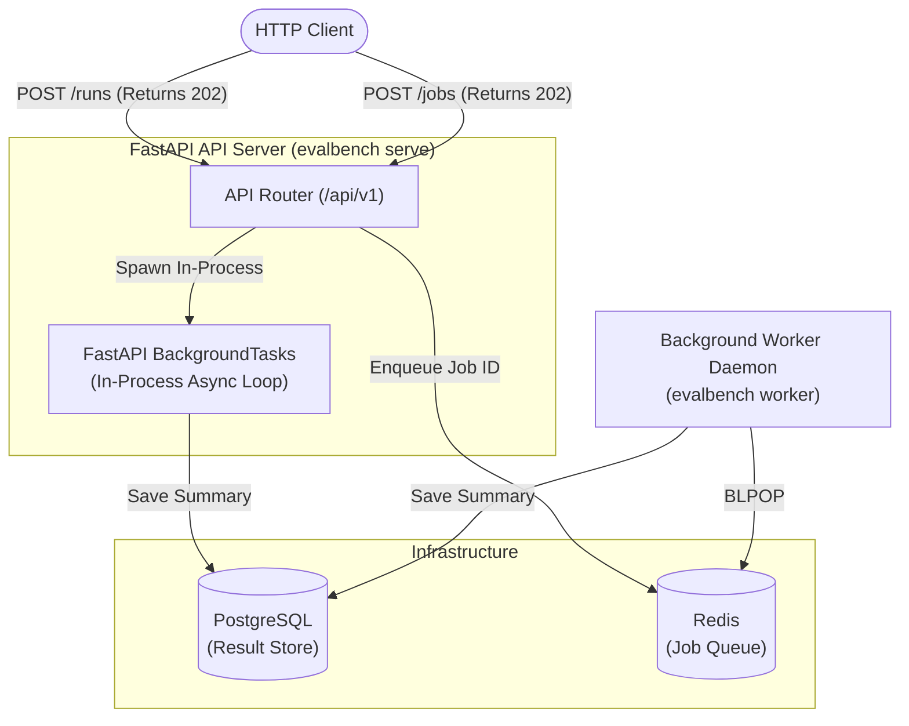

---

# 005-ADR: Adopt FastAPI with In-Process BackgroundTasks for the HTTP API Layer

**Date:** 2026-08-28
**Status:** Accepted
**Deciders:** evalbench team
**Tags:** api, fastapi, background-tasks, architecture, web-framework, async

---

## Context

`evalbench` was initially built as a command-line interface (`evalbench run`, `enqueue`, `status`, `worker`). While the CLI is effective for local terminal workflows, external integrations—such as web dashboards, CI/CD pipelines, remote evaluation triggers, and automated test runners—require an HTTP REST API.

When designing the API layer (`evalbench.api`), two architectural questions arose:

1. **Framework Choice**: Which Python web framework aligns best with the codebase's existing architecture, typing discipline, and performance needs?
2. **Execution Model for `POST /runs`**: How should ad-hoc evaluation requests be executed without blocking HTTP request threads or requiring heavy distributed infrastructure for lightweight use cases?

## Decision

We will adopt **FastAPI** as the HTTP API framework and implement a **two-tier execution model** utilizing in-process **FastAPI `BackgroundTasks`** for `/api/v1/runs` and distributed **Redis queues** for `/api/v1/jobs`.

### Key Architectural Choices

1. **Native Pydantic v2 Alignment**: FastAPI natively leverages Pydantic models for request validation, query parameter parsing, and response serialization. This allows direct reuse of domain schemas ([`evalbench/schema.py`](file:///e:/ai/evalbench/evalbench/schema.py)) with zero translation overhead.
2. **First-Class Asyncio & OpenAPI**: Async route handlers interface seamlessly with `asyncpg` connection pools and async LLM provider calls. Automatic interactive Swagger documentation is provided at `/docs`.
3. **In-Process `BackgroundTasks` for `/runs`**: Submitting an evaluation via `POST /api/v1/runs` returns `202 Accepted` immediately with a generated `run_id`. The evaluation executes asynchronously in the server process's event loop and writes results to PostgreSQL upon completion. Clients poll `GET /api/v1/runs/{run_id}` for status and metrics.
4. **Distributed Redis Queuing for `/jobs`**: For heavy, long-running batch workloads across multiple worker processes, `POST /api/v1/jobs` enqueues requests to Redis to be processed by decoupled worker daemons (`evalbench worker`).

## Alternatives Considered

### Option A: Synchronous Blocking Request-Response (`POST /runs` blocks)

Hold the HTTP connection open until the evaluation finishes, returning the final `RunSummary` in the response body.

- **Pros**: Simplest client workflow (single HTTP request without polling).
- **Cons**: Evaluation benchmarks can take anywhere from tens of seconds to multiple hours depending on dataset size and LLM rate limits. HTTP connections and reverse proxies (e.g. Nginx, Cloudflare, AWS ALB) inevitably terminate with `504 Gateway Timeout`. Blocking request workers destroys API concurrency.
- **Why we didn't choose it**: Incompatible with the variable latency profile of LLM benchmarking.

### Option B: Mandatory Heavy Task Queue (Celery / Temporal / Dramatiq)

Require a full distributed task broker for all evaluation requests.

- **Pros**: Robust persistence across server crashes and built-in task retries.
- **Cons**: Forces developers and single-instance deployments to provision and maintain a complex broker stack (RabbitMQ/Redis + dedicated worker processes) just to run a quick test via the API.
- **Why we didn't choose it**: Over-engineered for local and lightweight deployments. Our two-tier approach keeps standalone API servers zero-dependency while allowing distributed worker scaling when needed.

### Option C: Alternative Web Frameworks (Flask, Django REST Framework, Litestar)

- **Flask**: Lacks native async request handling and relies on third-party libraries for OpenAPI generation and Pydantic validation.
- **Django / DRF**: Overly heavyweight for a focused microservice API; assumes an ORM-based architectural pattern that conflicts with our lightweight `asyncpg` store.
- **Litestar**: Modern and fast, but has a smaller community and fewer integrations compared to FastAPI.
- **Why we didn't choose them**: FastAPI is the industry standard for Python microservices, offering optimal typing integration with Pydantic and async database drivers.

## Consequences

### Positive

- **Lightweight Standalone Server**: Developers can run the API server (`evalbench serve`) with only a PostgreSQL instance; Redis is strictly optional (`EVALBENCH_REDIS_ENABLED=false` by default).
- **Zero Schema Duplication**: API DTOs directly inherit from and encapsulate core `EvalRunConfig` models.
- **Interactive Documentation**: Auto-generated Swagger UI (`/docs`) and OpenAPI specification (`/openapi.json`) enable immediate testing and client SDK generation.
- **High Concurrency**: The async server handles hundreds of concurrent polling clients without blocking execution threads.

### Negative

- **Process Crash Volatility (for `/runs`)**: In-process background tasks are stored in memory during execution. If the API server is abruptly killed (e.g. OOM or container restart), in-flight `/runs` are lost. *(Workaround: Use `/jobs` backed by Redis for fault-tolerant batch workloads).*
- **Optional Dependencies**: Requires `fastapi`, `uvicorn`, and `pydantic-settings`, packaged as `[api]` extras so CLI-only installations remain minimal.

### Neutral

- API clients must implement a polling loop on `GET /runs/{run_id}` or `GET /jobs/{job_id}` to retrieve results.

## Follow-up Actions

- [x] Package FastAPI dependencies under optional `[api]` extra in `pyproject.toml`.
- [x] Implement in-process background execution in `evalbench/api/routers/runs.py`.
- [x] Expose CLI entry point via `evalbench serve`.
- [ ] Add optional WebSocket/SSE progress streaming in a future phase if live real-time progress bars are needed.

## References

- [FastAPI Documentation](https://fastapi.tiangolo.com/)
- [ADR-001: Flat Package Layout and Docs Hierarchy](001-directory-structure.md)
- [ADR-004: Redis Queue vs PostgreSQL Storage Separation](004-transient-redis-queue-and-postgres-result-separation.md)
- [FastAPI Integration Plan](../fastapi-integration-plan.md)
