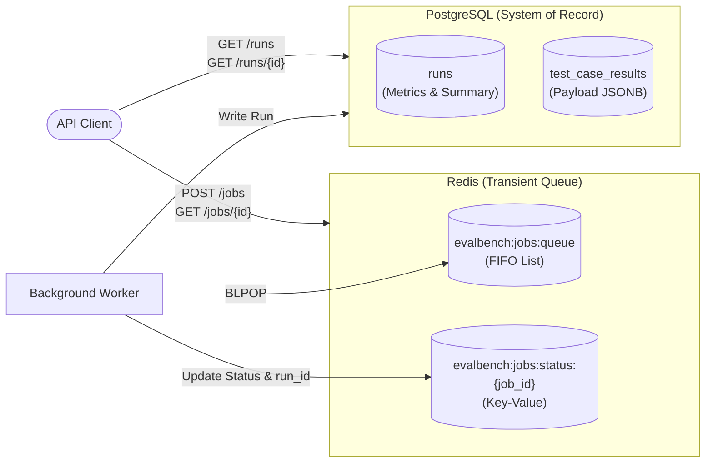

---

# 004-ADR: Separate Transient Redis Job Queues from PostgreSQL Historical Result Storage

**Date:** 2026-08-28
**Status:** Accepted
**Deciders:** evalbench team
**Tags:** api, redis, postgres, architecture, storage, jobs, runs

---

## Context

When introducing the REST API layer (`evalbench.api`) and distributed worker execution, we needed an endpoint and storage strategy for managing evaluations. Clients interact with the system in two distinct ways:

1. **Active Job Dispatch & Tracking**: Submitting evaluation requests to background workers, receiving immediate acceptance, and polling for completion status.
2. **Historical Browsing & Analytics**: Querying, filtering, paginating, and comparing completed evaluation runs and test case metrics over time.

We had to decide whether the API should expose a general `GET /jobs` collection endpoint backed by Redis, or enforce a strict separation where Redis manages transient job dispatching and PostgreSQL acts as the sole system of record for completed runs.

## Decision

We will strictly separate **transient task dispatching** (Redis) from **persistent system-of-record storage** (PostgreSQL):

1. **Redis for Transient Queueing**: Redis is used strictly for FIFO queueing (`BLPOP` on `evalbench:jobs:queue`) and point-in-time key-value status tracking (`evalbench:jobs:status:{job_id}`). We will **not** provide a `GET /api/v1/jobs` list endpoint, avoiding expensive `KEYS` or `SCAN` operations across Redis.
2. **PostgreSQL for Historical System of Record**: PostgreSQL stores all completed `RunSummary` records, evaluator metrics, and individual `TestCaseResult` payloads. All collection listing, filtering (by dataset, provider, timestamps), and pagination are exposed exclusively through `GET /api/v1/runs`.
3. **Run ID Handoff**: When a background worker completes an `EvalJob`, it commits the final `RunSummary` into PostgreSQL, updates the Redis job status to `completed`, and records the resulting `run_id`. Clients can fetch the completed output directly via `GET /api/v1/jobs/{job_id}/results` or query `GET /api/v1/runs/{run_id}`.

## Alternatives Considered

### Option A: Store Full Job History in Redis (with `GET /jobs`)

Maintain all jobs indefinitely in Redis and implement `GET /jobs` using Redis Sorted Sets (`ZSET`) or key scanning.

- **Pros**: Single technology stack for distributed execution; simpler mental model if everything is a "job".
- **Cons**: Redis is an in-memory database; keeping large benchmark payloads (prompts, raw LLM completions, evaluator scores) causes memory bloat. Implementing relational filtering, pagination, and JSON analytics on Redis is complex and risks blocking the single-threaded Redis event loop during heavy scans.
- **Why we didn't choose it**: Redis is optimized for fast, transient queues, not analytical querying or long-term persistence.

### Option B: Use PostgreSQL for Both Queuing and Results Storage (No Redis)

Implement queueing directly in PostgreSQL using transactional locks (e.g. `FOR UPDATE SKIP LOCKED`).

- **Pros**: Removes the Redis dependency entirely; single database to deploy and maintain; `GET /jobs` could be a simple SQL query.
- **Cons**: High write-amplification and connection contention on PostgreSQL under high-concurrency evaluation workloads; lacks lightweight blocking pop primitives (`BLPOP`); makes running standalone API deployments without database polling overhead harder.
- **Why we didn't choose it**: Redis provides superior sub-millisecond atomic dispatch and disconnects worker throughput from relational database lock contention.

### Option C (chosen): Hybrid Split — Redis for Queueing, PostgreSQL for Run History

Use Redis strictly as a lightweight dispatcher and PostgreSQL as the queryable data warehouse.

- **Pros**: Clean separation of concerns; zero risk of Redis memory exhaustion from old jobs; PostgreSQL handles relational queries, indexing, and JSONB filtering efficiently; API remains fast and scalable.

## Consequences

### Positive

- **Performance**: High-throughput, non-blocking job distribution via Redis with zero overhead on PostgreSQL during queue operations.
- **Rich Querying**: Full SQL capabilities, GIN indexing on `metrics`, and deterministic pagination on `GET /api/v1/runs`.
- **Resource Efficiency**: Redis memory remains bounded since completed queue items are transient.
- **Flexible Deployment**: In-process runs (`POST /api/v1/runs`) work with only PostgreSQL; Redis is strictly optional unless distributed workers are used (`EVALBENCH_REDIS_ENABLED=false` by default).

### Negative

- **No Global Active Job Listing**: The API cannot list all pending/in-flight jobs in a single endpoint without introducing secondary indexing sets in Redis.
- **Dual Infrastructure**: Distributed mode requires operating both a Redis instance and a PostgreSQL database.

### Neutral

- API clients must distinguish between tracking an in-flight job (`/jobs/{job_id}`) and browsing completed evaluation history (`/runs`).

## Follow-up Actions

- [x] Implement `/api/v1/jobs` and `/api/v1/runs` endpoint separation in FastAPI routers.
- [x] Configure optional Redis initialization controlled by `EVALBENCH_REDIS_ENABLED`.
- [ ] Add an optional `GET /api/v1/jobs/stats` or `queue_depth` endpoint if queue backlog visibility is requested.

## References

- [ADR-001: Flat Package Layout and Docs Hierarchy](001-directory-structure.md)
- [FastAPI API Layer Integration Plan](../fastapi-integration-plan.md)
- [ARCHITECTURE.md](../../ARCHITECTURE.md)
