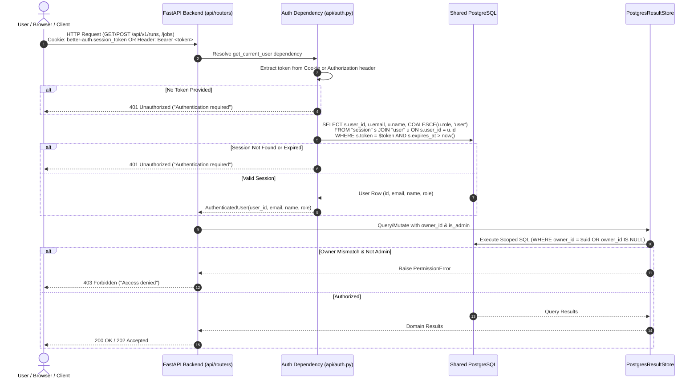

---

# 006-ADR: Shared PostgreSQL Session Verification and Benchmark Ownership Scoping
---
**Date:** 2026-09-15  
**Status:** Accepted  
**Deciders:** evalbench team  
**Tags:** auth, security, postgresql, fastapi, multi-tenant, ownership, better-auth  

---

## Context

`evalbench` features a Next.js frontend paired with a Python FastAPI backend. The frontend implements [Better Auth](https://better-auth.com) backed by PostgreSQL to manage user registration, credentials, and session cookies.

Previously, the FastAPI backend had no authentication layer or data ownership model:
1. **Unauthenticated Access**: Any client could execute `GET /api/v1/runs`, `POST /api/v1/runs`, `DELETE /api/v1/runs/{id}`, or job endpoints without credentials.
2. **Global Visibility**: The PostgreSQL `runs` and `test_case_results` tables lacked user identifiers (`owner_id`), exposing all evaluation benchmarks and test case traces to anyone with network access.
3. **Multi-User Conflict**: Teams sharing an instance had no mechanism to isolate proprietary runs, prevent unauthorized deletions, or grant administrative oversight across evaluations.

We needed an authentication and authorization architecture that enforces strict per-user ownership and access control in the FastAPI backend without introducing redundant identity infrastructure or brittle token exchange protocols.

---

## Decision

We will **verify Better Auth sessions directly against the shared PostgreSQL database** in FastAPI dependency injection and enforce **row-level ownership scoping** across all runs, jobs, and test case results.



---

### Core Architecture Components

#### 1. Authentication Dependency ([`evalbench/api/auth.py`](file:///e:/dev/evalbench/backend/evalbench/api/auth.py))
- **Token Ingestion**: Inspects requests for `better-auth.session_token` cookie, `__Secure-better-auth.session_token` cookie, and `Authorization: Bearer <token>` header. Supports cookie signature stripping (`token.split('.')[0]`).
- **Session Verification**: Directly queries the `session` and `user` tables managed by Better Auth in PostgreSQL:
  ```sql
  SELECT s.user_id, u.email, u.name, COALESCE(u.role, 'user') AS role
  FROM "session" s
  JOIN "user" u ON s.user_id = u.id
  WHERE (s.token = $1 OR s.token = $2)
    AND s.expires_at > now()
  ```
- **Error Handling**: Missing, expired, or invalid sessions raise `HTTPException(401, "Authentication required. Please sign in.")` immediately, preventing unauthenticated access to downstream route handlers.

#### 2. Ownership Database Schema ([`evalbench/storage/schema.sql`](file:///e:/dev/evalbench/backend/evalbench/storage/schema.sql))
- Adds `owner_id TEXT` (nullable) to the `runs` table with index `idx_runs_owner_id`.
- Auto-migrated on startup via `ALTER TABLE runs ADD COLUMN IF NOT EXISTS owner_id TEXT;` inside `ensure_schema()`.
- Legacy runs (`owner_id IS NULL`) remain accessible to all authenticated users for backward compatibility.

#### 3. Store Layer Authorization ([`evalbench/storage/postgres_store.py`](file:///e:/dev/evalbench/backend/evalbench/storage/postgres_store.py))
- **`asave()`**: Persists `owner_id` on run creation and preserves it on metric upsert conflicts.
- **`list_runs()`**: Scopes queries to `(owner_id = $owner_id OR owner_id IS NULL)` for standard users, or returns all records when `is_admin=True`.
- **`aget_run()` / `aload()` / `adelete()`**: Verifies ownership before returning or mutating results. Raises `PermissionError` (mapped to `403 Forbidden` in the API router) if a non-admin attempts to access another user's run.

#### 4. Async Distributed Worker Support ([`evalbench/storage/redis_queue.py`](file:///e:/dev/evalbench/backend/evalbench/storage/redis_queue.py) & [`worker.py`](file:///e:/dev/evalbench/backend/evalbench/storage/worker.py))
- [`EvalJob`](file:///e:/dev/evalbench/backend/evalbench/storage/redis_queue.py) carries `owner_id: str | None = None` through the Redis queue lifecycle.
- Workers write the originator's `owner_id` to PostgreSQL upon benchmark completion.

---

## Alternatives Considered

### Option A: Custom Token Exchange Service / Next.js JWT Minting

Have Next.js generate a signed JWT (or session ticket) on each API call and have FastAPI verify it via asymmetric cryptography (JWKS).

- **Pros**: Stateless verification in FastAPI (no DB query per request).
- **Cons**: Requires building and securing a token-minting endpoint, managing key rotation, configuring JWKS caching, and synchronizing token lifetimes across Next.js and Python.
- **Why we didn't choose it**: Over-engineered for a co-located architecture. Both frontend and backend connect to the same PostgreSQL instance; direct session table lookup is simpler, instant, and eliminates session invalidation lag.

### Option B: Independent API Keys or Separate Backend Auth

Implement a dedicated user authentication and registration system inside FastAPI using OAuth2 password flow and bcrypt hashes.

- **Pros**: Decouples backend auth from frontend auth provider.
- **Cons**: Forces users to maintain dual accounts or dual credentials; fragments user identity between the Next.js UI and FastAPI API; significantly increases security audit surface area.
- **Why we didn't choose it**: Better Auth already handles secure password hashing, session caching, and identity management. Sharing the PostgreSQL session store provides single sign-on across UI and API.

### Option C (Chosen): Direct Shared PostgreSQL Session Verification

FastAPI resolves user identity by reading the active Better Auth session directly from PostgreSQL using `asyncpg`.

- **Pros**:
  - Single source of truth for user identities and active sessions.
  - Zero token-exchange or custom cryptography overhead.
  - Instant session revocation (deleting a session in Better Auth immediately terminates backend API access).
  - Clean FastAPI dependency injection (`Depends(get_current_user)`).
- **Why this one**: Seamlessly connects Better Auth with FastAPI, delivers strict data isolation, and requires zero extra infrastructure.

---

## Consequences

### Positive

- **Strict Access Control**: Unauthenticated requests to `/api/v1/runs` and `/api/v1/jobs` are rejected with `401 Unauthorized`.
- **Data Isolation**: Benchmark results, configurations, and detailed test case traces are strictly isolated to their creator (`owner_id`).
- **Role-Based Admin Access**: Users with `role = 'admin'` in Better Auth can inspect and manage all runs and jobs across all users.
- **Zero Additional Services**: Leverages existing PostgreSQL connection pool (`asyncpg`); no extra auth microservice, Redis auth cache, or key server required.
- **Seamless Frontend Integration**: Works out-of-the-box with `apiClient` using standard browser cookie delegation (`credentials: 'include'`) and `Authorization: Bearer` headers.

### Negative

- **Database Coupling**: The backend expects Better Auth's `session` and `user` table schemas to exist in the shared PostgreSQL database.
- **Per-Request Query**: Each authenticated request performs a fast indexed lookup (`s.token = $1`) in PostgreSQL.

### Neutral

- Legacy runs created prior to ownership implementation have `owner_id = NULL` and remain visible to all authenticated users.

---

## References

- [ADR-004: FastAPI with In-Process BackgroundTasks for API Layer](004-fastapi-and-background-tasks-for-api-layer.md)
- [ADR-005: Transient Redis Queue and PostgreSQL Result Separation](005-transient-redis-queue-and-postgres-result-separation.md)
- [Frontend ADR-002: Use Better Auth for Authentication](../../frontend/docs/adr/002-use-better-auth-for-authentication.md)
- [Better Auth Database Schema Documentation](https://better-auth.com/docs/concepts/database)
