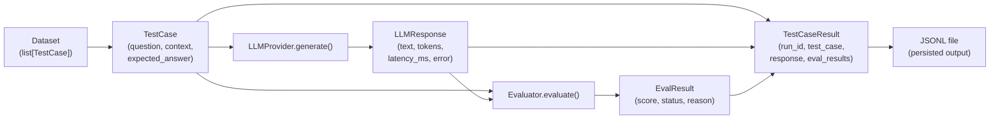

# 001 — The Evaluation Data Model

> **Relates to:** `evalbench/schema.py` — core data layer used by all evaluators, providers, and result persistence
> **Prerequisites:** None. This is the foundational concept. Read this before any other concept doc in this repo.
> **Canonical reference:** [Pydantic v2 documentation](https://docs.pydantic.dev/latest/)

---

## What this is

An evaluation benchmark pipeline processes structured data at every stage: it takes in a test case, sends a prompt to a model, receives a response, scores it against expectations, and persists the result. Each of those stages needs a well-defined, validated data shape — not a raw dict that could be missing keys or carrying unexpected types.

This project uses five Pydantic `BaseModel` classes to represent those stages. Together they form the **data model**: the shared vocabulary that every module in the codebase speaks. Understanding these five types — what they contain, what is required vs. optional, and how they relate — is the prerequisite for working on any part of the system.

---

## The five types

```
TestCase ──────────────────────────────────────────────┐
                                                        │
         ┌──── LLMResponse ──────────────────────────┐ │
         │                                            │ │
         │     Evaluator(TestCase, LLMResponse)       │ │
         │          └──► EvalResult                   │ │
         │                    │                       │ │
         └────────────────────┴── TestCaseResult ◄────┘ │
                                                         │
Dataset (list[TestCase]) ────────────────────────────────┘
```

### `TestCase`

A single evaluation prompt and its expected outcome. This is the **input** to a benchmark run.

| Field | Type | Required | Notes |
|---|---|---|---|
| `id` | `str` | Yes (auto) | UUID, generated if not supplied |
| `question` | `str` | **Yes** | The prompt sent to the model. Cannot be empty or whitespace-only — enforced by a `@field_validator`. |
| `context` | `str \| None` | No | Optional passage or document for retrieval/RAG scenarios |
| `expected_answer` | `str \| None` | No | Ground truth. Required by most evaluators — they return `score=0.0, passed=False` if absent |
| `reference_contexts` | `list[str] \| None` | No | Gold-standard retrieved passages, for RAG evaluations |
| `metadata` | `dict[str, Any]` | No | Freeform key-value store. Defaults to `{}`. Use for tags, source, difficulty, etc. |

**Validation rule:** `question` is validated at construction time. An empty string or a string of whitespace raises `ValidationError` immediately — you never get a `TestCase` with a blank question into the pipeline.

```python
# Raises ValidationError — question cannot be whitespace-only
TestCase(id="t1", question="   ")

# Valid
TestCase(id="t1", question="What is the capital of France?", expected_answer="Paris")
```

---

### `Dataset`

An ordered collection of `TestCase` objects with a name and version. This is the **batch input** to a benchmark run.

| Field | Type | Required | Notes |
|---|---|---|---|
| `name` | `str` | **Yes** | Human-readable label for the dataset |
| `version` | `str` | No | Defaults to `"v1"`. Use for tracking dataset iterations |
| `description` | `str \| None` | No | Free-text description |
| `test_cases` | `list[TestCase]` | No | Defaults to `[]`. Populated by `from_jsonl` or direct construction |

`Dataset` supports two conveniences built on top of the Pydantic base:

- `__len__` — `len(dataset)` returns the number of test cases
- `__iter__` — `for tc in dataset` iterates over test cases directly

**Loading from JSONL:**

```python
dataset = Dataset.from_jsonl("path/to/cases.jsonl")
```

Each line of the file is a JSON object that maps directly to a `TestCase`. The loader reads line-by-line (streaming — never loads the whole file at once), validates each record through Pydantic, and raises a descriptive `ValueError` with the filename and line number on any malformed line.

**Saving to JSONL:**

```python
dataset.to_jsonl("path/to/output.jsonl")
```

Each `TestCase` is serialized via `model_dump_json()` — one compact JSON object per line, no trailing comma, no wrapping array.

---

### `LLMResponse`

The raw output from a model provider, plus measured performance data. This is the **output** of a single `generate()` call.

| Field | Type | Required | Notes |
|---|---|---|---|
| `text` | `str` | **Yes** | The model's response text |
| `prompt_tokens` | `int \| None` | No | Tokens consumed by the prompt |
| `completion_tokens` | `int \| None` | No | Tokens in the completion |
| `total_tokens` | `int \| None` | No | Sum of prompt + completion. May differ from the sum if the provider reports it separately |
| `latency_ms` | `float` | No | End-to-end wall-clock time in milliseconds. Measured by `LLMProvider.generate()`, not the provider SDK — defaults to `0.0` |
| `cost_usd` | `float \| None` | No | Estimated cost, if the provider returns it |
| `model` | `str` | No | Model identifier. Filled in by `generate()` from the provider's config if the provider itself does not set it |
| `provider` | `str` | No | Provider name (`"openai"`, `"anthropic"`, etc.). Filled in by `generate()` |
| `raw` | `dict \| None` | No | The full, unprocessed API response. Useful for debugging or accessing fields not mapped to schema |
| `error` | `str \| None` | No | Non-`None` when the request failed after all retries. Format: `"ExceptionType: message"` |
| `retrieved_context` | `list[str] \| None` | No | Passages retrieved in a RAG pipeline, if applicable |

**The `ok` property:**

```python
response.ok  # True if error is None, False otherwise
```

This is the canonical way to check whether a response is usable. Evaluators should check `response.ok` before scoring — an errored response should not be judged as a wrong answer.

**Key design point:** `LLMProvider.generate()` never raises. If a request fails after all retries, it returns an `LLMResponse` with `text=""` and `error` set. This means callers always get a `LLMResponse` — they never need to `try/except` around `generate()`. Checking `response.ok` is the contract.

---

### `EvalResult`

The output of a single evaluator applied to a single `(TestCase, LLMResponse)` pair. This is the **atomic unit of evaluation output**.

| Field | Type | Required | Notes |
|---|---|---|---|
| `evaluator_name` | `str` | **Yes** | The evaluator's `name` class attribute (e.g., `"exact_match"`, `"latency"`) |
| `test_case_id` | `str` | **Yes** | The `id` from the `TestCase` that was evaluated |
| `score` | `float` | **Yes** | `0.0`–`1.0`. See scoring conventions below |
| `status` | `EvalStatus` | **Yes** | `PASSED`, `FAILED`, or `ERROR` |
| `reason` | `str \| None` | No | Human-readable explanation of failure. `None` on pass |
| `metadata` | `dict[str, Any]` | No | Evaluator-specific extra data (e.g., `latency_ms`, `token_counts`) |

**`EvalStatus` values:**

```python
class EvalStatus(str, Enum):
    PASSED = "passed"
    FAILED = "failed"
    ERROR  = "error"
```

`ERROR` is reserved for cases where the evaluator itself could not run (e.g., the `LLMResponse` had `error` set, or a required field was missing). It is distinct from `FAILED`, which means the evaluator ran successfully and the model's answer was wrong.

**Scoring convention:**

All evaluators emit a score in `[0.0, 1.0]`. The meaning depends on the evaluator type:

| Evaluator type | `score=1.0` means | `score=0.0` means | Notes |
|---|---|---|---|
| Correctness (`exact_match`, `contains`) | Correct answer | Wrong answer | Binary |
| Validity (`json_validity`) | Output is valid JSON | Output is invalid JSON | See partial score below |
| Budget (`latency`, `token_usage`) | Under threshold (or no threshold set) | Over threshold | Binary |
| Schema partial (`json_validity` with `require_schema`) | — | Missing required keys | `score=0.5` for valid JSON with missing keys |

Scores are not averaged or weighted by the schema layer — that is a concern for the analysis/reporting layer. Each `EvalResult` is an independent observation.

---

### `TestCaseResult`

The complete record for one test case in one benchmark run — binding together the input, the model's output, and all evaluator scores. This is the **unit of storage**.

| Field | Type | Required | Notes |
|---|---|---|---|
| `run_id` | `str` | **Yes** | Identifies the benchmark run this result belongs to |
| `test_case` | `TestCase` | **Yes** | The full input, embedded (not just its `id`) |
| `response` | `LLMResponse` | **Yes** | The full model response |
| `eval_results` | `list[EvalResult]` | No | One entry per evaluator applied. Defaults to `[]` |
| `timestamp` | `float` | No | Unix epoch seconds, set at construction via `time.time()` |

`summary()` returns a `dict[evaluator_name → score]` for quick inspection:

```python
result.summary()
# {"exact_match": 1.0, "latency": 0.0, "token_usage": 1.0}
```

---

## Full lifecycle



A benchmark run processes `N` test cases. For each:

1. A `TestCase` is read from a `Dataset` (loaded from JSONL or constructed in code)
2. Its `question` (and optionally `context`) is sent to `LLMProvider.generate()`
3. The provider returns an `LLMResponse`. If `response.ok` is `False`, evaluators receive it and should emit `ERROR` status
4. Each configured `Evaluator` receives `(test_case, response)` and returns an `EvalResult`
5. All results are packed into a `TestCaseResult` and written to the output JSONL

---

## Trade-offs

**Embedding `TestCase` in `TestCaseResult` vs. storing just the `id`**

`TestCaseResult` stores the full `TestCase` object, not just its `id`. This makes each output record self-contained and independently readable — you can inspect a result without cross-referencing the input dataset. The cost is storage duplication when the same dataset is run multiple times. For the current local-disk use case this is acceptable; at scale (large datasets, many runs) a normalised storage model would be more appropriate.

**`total_tokens` is not validated against `prompt_tokens + completion_tokens`**

The schema accepts all three independently. Some providers return only `total_tokens`, some return all three, some return none. The schema makes no assumption — it accepts whatever the provider gives. This means `total_tokens` could technically be inconsistent with the sum of the parts. Validation of this constraint is left to the provider implementation, not the schema.

**`score` is always binary in the current evaluators**

The schema allows any float in `[0.0, 1.0]`, and `json_validity` already uses `0.5` for a partial pass. But `exact_match`, `contains`, `latency`, and `token_usage` all produce only `0.0` or `1.0`. Graded/partial scoring (e.g., ROUGE score, embedding cosine similarity) would require new evaluators — the schema already supports it, the evaluator layer does not yet.

**No run-level aggregate model**

There is no `BenchmarkRun` or `RunSummary` schema type. `TestCaseResult` carries a `run_id` string for grouping, but there is no Pydantic model that wraps a list of `TestCaseResult` objects, holds run-level metadata, or pre-aggregates scores. Aggregation is deferred to an analysis layer that does not yet exist.

---

## Further reading

- [Pydantic v2 — Field validators](https://docs.pydantic.dev/latest/concepts/validators/)
- [Pydantic v2 — `model_dump` and `model_dump_json`](https://docs.pydantic.dev/latest/concepts/serialization/)
- [JSON Lines format](https://jsonlines.org/)
- [002 — How Evaluators Work](002-evaluator-model.md) ← read next
