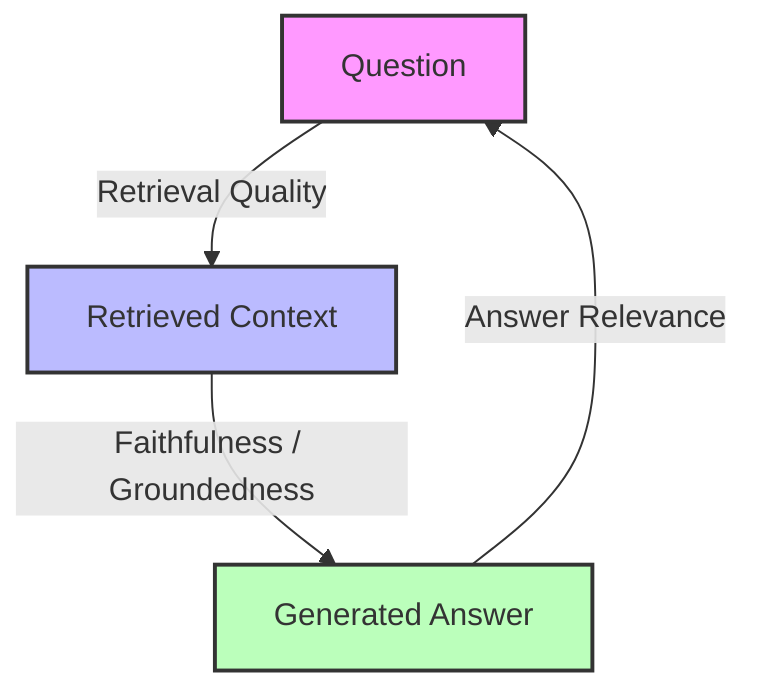
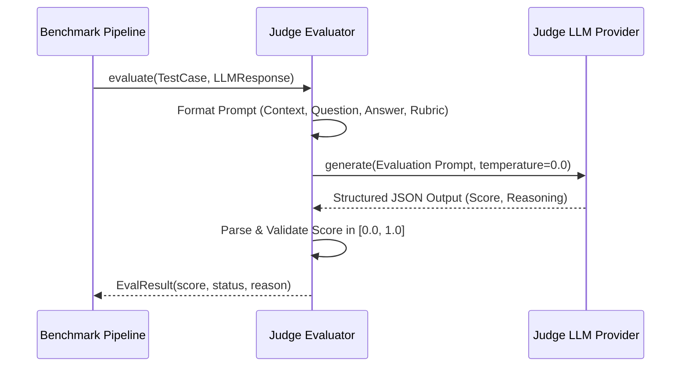

# 004 — The RAG Triad and Evaluation Metrics

> **Relates to:** `evalbench/evaluators/` (`faithfulness`, `answer_relevance`, `context_precision`, `context_recall`, `llm_judge`)
> **Prerequisites:** [001 — The Evaluation Data Model](001-data-model.md), [002 — How Evaluators Work](002-evaluator-model.md), [003 — LLM Provider Abstraction](003-provider-abstraction.md)
> **Canonical reference:** [Ragas: Automated Evaluation of Retrieval Augmented Generation (Es et al., 2023)](https://arxiv.org/abs/2309.15217)

---

## What this is

Retrieval-Augmented Generation (RAG) architectures combine an external information retrieval component with an autoregressive language model. Evaluating RAG systems requires assessing both the **retrieval quality** (did we fetch the right passages?) and the **generation quality** (did the model accurately use those passages to answer the user's question?).

Standard string-matching evaluators (`exact_match`, `contains`) fail to evaluate RAG systems because natural language answers can be syntactically varied yet semantically correct, or superficially plausible yet factually hallucinated. 

This concept document breaks down the **RAG Triad framework** and the four core metrics used to evaluate RAG pipelines: **Faithfulness**, **Answer Relevance**, **Context Precision**, and **Context Recall**.

---

## The RAG Triad

A RAG workflow involves three interacting elements: the **Question** ($Q$), the **Retrieved Context** ($C$), and the Generated **Answer** ($A$).

The triad defines the three critical relationships:

1. **Context Relevance / Precision ($Q \leftrightarrow C$)**: Is the retrieved context relevant to the question?
2. **Faithfulness ($C \rightarrow A$)**: Is the generated answer grounded exclusively in the retrieved context (no hallucinations)?
3. **Answer Relevance ($A \rightarrow Q$)**: Does the generated answer address the actual question asked?

---

## Core RAG Metrics & Formulations

### 1. Faithfulness (Groundedness)

Measures whether all claims made in the generated answer can be inferred directly from the retrieved context.

$$\text{Faithfulness} = \frac{|\text{Supported Claims in Answer}|}{|\text{Total Distinct Claims in Answer}|}$$

#### How It Works:
1. **Claim Extraction**: An LLM judge decomposes the answer $A$ into a list of atomic factual claims: $A \rightarrow \{s_1, s_2, \dots, s_n\}$.
2. **Verification**: For each claim $s_i$, the LLM verifies whether $s_i$ is logically entailed by context $C$.
3. **Scoring**: If 4 out of 5 claims are supported by $C$, the score is $0.80$. If the model states facts outside $C$ (even if true in the real world), the claim is unfaithful.

---

### 2. Answer Relevance

Measures whether the generated answer directly answers the question, penalizing incomplete, repetitive, or tangential outputs.

$$\text{Answer Relevance} = \frac{1}{m} \sum_{i=1}^m \text{sim}(Q, Q_i^{\text{gen}})$$

#### How It Works:
1. **Reverse Question Generation**: The LLM judge generates $m$ potential questions $\{Q_1^{\text{gen}}, \dots, Q_m^{\text{gen}}\}$ that the answer $A$ would naturally answer.
2. **Semantic Similarity**: The cosine similarity between the embedding of the original question $Q$ and each generated question $Q_i^{\text{gen}}$ is computed and averaged.
3. **Alternative (Judge Scoring)**: An LLM judge rates how directly $A$ answers $Q$ on a normalized scale $[0.0, 1.0]$.

---

### 3. Context Precision

Measures the signal-to-noise ratio of the retrieval component by evaluating whether relevant passages are ranked at the top of the context list.

$$\text{Context Precision@K} = \frac{1}{\text{Total Relevant Passages}} \sum_{k=1}^K \text{Precision@}k \times \mathbb{I}(\text{passage } k \text{ is relevant})$$

Where $\text{Precision@}k = \frac{\text{Relevant passages in top } k}{k}$.

#### How It Works:
- Penalizes retrievers that place relevant information at the bottom of the retrieved passage list (the "Lost in the Middle" effect).
- A passage is relevant if it contains information necessary to construct the ground-truth expected answer.

---

### 4. Context Recall

Measures the completeness of the retrieval step against a ground-truth gold reference answer ($A_{\text{gold}}$).

$$\text{Context Recall} = \frac{|\text{Claims in } A_{\text{gold}} \text{ attributed to retrieved context } C|}{|\text{Total Claims in } A_{\text{gold}}|}$$

#### How It Works:
1. Decompose the gold expected answer $A_{\text{gold}}$ into atomic claims.
2. For each gold claim, verify whether it can be found in the retrieved context $C$.
3. If the context is missing key facts required to answer the question, Context Recall drops, indicating retrieval failure.

---

## LLM-as-a-Judge Evaluation Pattern

Because RAG metrics require semantic reasoning, they utilize an **LLM-as-a-Judge** evaluator:

### Determinism Best Practices
- **Temperature 0.0**: Eliminates random sampling variance.
- **Few-Shot Examples**: Concrete examples of passing and failing evaluations in the judge prompt calibrate scoring boundaries.
- **Chain-of-Thought Rubrics**: Requiring the judge to output a step-by-step reasoning string before the numerical score significantly improves consistency.

---

## Trade-offs & Limitations

### 1. Judge Model Bias & Alignment
- **Self-Preference**: Judge models from provider X tend to favor completions generated by provider X.
- **Verbosity Bias**: Judges frequently assign higher relevance scores to longer, more verbose answers.

### 2. Latency & Token Cost
- LLM-based evaluators require 1–3 additional inference calls per test case. For benchmark runs with 1,000 test cases, judge evaluation costs can exceed the initial response generation cost.

### 3. Non-Binary Scoring Distribution
- While rule-based evaluators (`exact_match`) output binary `{0.0, 1.0}`, RAG metrics output continuous distributions `[0.0, 1.0]`. Thresholds for pass/fail classification (e.g. `score >= 0.70`) must be tuned per benchmark dataset.

---

## Further Reading

- [Ragas Framework Paper](https://arxiv.org/abs/2309.15217) — Architectural foundation for automated RAG metrics.
- [Judging LLM-as-a-Judge (Zheng et al., 2023)](https://arxiv.org/abs/2306.05685) — Analysis of judge biases and consistency.
- [002 — How Evaluators Work](002-evaluator-model.md) — Base evaluator architecture in this codebase.
- [005 — In-Memory Retrieval and Context Ranking](005-in-memory-retrieval-and-context-ranking.md) ← read next
