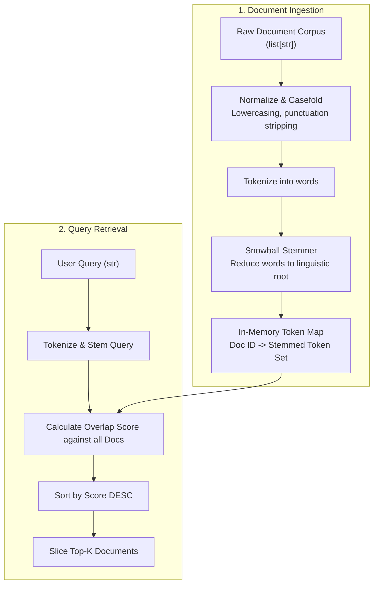

# 005 — In-Memory Retrieval and Context Ranking

> **Relates to:** `evalbench/retrieval/` (`InMemoryRetriever`, `Retriever` interface, tokenization, stemming)
> **Prerequisites:** [001 — The Evaluation Data Model](001-data-model.md), [004 — The RAG Triad and Evaluation Metrics](004-rag-evaluation-metrics.md)
> **Canonical reference:** [Introduction to Information Retrieval (Manning, Raghavan, Schütze, 2008)](https://nlp.stanford.edu/IR-book/)

---

## What this is

In a Retrieval-Augmented Generation (RAG) benchmark pipeline, the model is evaluated not just on its internal weights, but on its ability to utilize externally retrieved reference documents. 

Evaluating retrieval systems typically requires connecting to specialized vector databases or search engines. However, for deterministic benchmarking, local unit testing, and lightweight evaluation suites, an **in-memory lexical retriever** provides a zero-dependency, self-contained retrieval mechanism.

This document explains the algorithms behind in-memory lexical document indexing, Snowball linguistic stemming, overlap scoring, and top-$k$ context selection.

---

## Lexical vs. Dense Vector Retrieval

Information retrieval components generally fall into two categories:

| Dimension | Lexical Retrieval (BM25 / Overlap) | Dense Vector Retrieval (Embeddings) |
|---|---|---|
| **Matching Mechanism** | Exact term tokens and linguistic stems | High-dimensional geometric cosine distance |
| **Indexing Structure** | Inverted index / Term frequency arrays | HNSW / IVF vector graphs |
| **Strengths** | Exact keyword precision (IDs, code, acronyms, names) | Semantic paraphrasing and synonym matching |
| **Dependencies** | Pure in-memory Python data structures | Embedding models (OpenAI, HuggingFace) + Vector DB |
| **Determinism** | 100% deterministic and reproducible | Floating-point variance across embedding backends |

---

## How In-Memory Lexical Retrieval Works



---

## Mathematical Formulation & Scoring

The `InMemoryRetriever` scores candidate documents against a query based on **normalized stemmed term overlap**:

### 1. Token Stemming

Each word token $w$ is mapped to its morphological root stem $s = \text{stem}(w)$ using the Snowball algorithm (e.g. `"running"`, `"runs"`, `"ran"` $\rightarrow$ `"run"`).

$$\text{Stems}(D) = \{ \text{stem}(w) \mid w \in \text{tokenize}(D) \}$$

### 2. Overlap Scoring

For a query $Q$ and candidate document $D_j$, the raw score counts how many unique query terms appear in the document:

$$\text{Score}(Q, D_j) = \sum_{t \in \text{Stems}(Q)} \mathbb{I}(t \in \text{Stems}(D_j))$$

Where $\mathbb{I}(\cdot)$ is the indicator function ($1$ if the term is present in $D_j$, $0$ otherwise).

### 3. Top-K Context Window Slicing

Documents are ranked by score in descending order, with ties broken deterministically by original document index. The top $K$ documents are concatenated to form the final retrieved context:

$$C = \text{TopK}(\{D_1, D_2, \dots, D_N\}, K)$$

---

## Prompt Template Injection

Once the top-$k$ documents are retrieved, they are formatted into the execution prompt template before being dispatched to the language model:

```python
# Format retrieved context
context_block = "\n\n".join(retrieved_docs)

# Inject into prompt template
final_prompt = prompt_template.format(
    question=test_case.question,
    context=context_block
)
```

The model receives both the prompt and the retrieved context, and the output `LLMResponse.retrieved_context` is recorded for subsequent evaluation metrics (`context_precision`, `faithfulness`).

---

## Trade-offs & Limitations

### 1. Vocabulary Mismatch (Semantic Blindness)
- Lexical retrieval fails when the user query uses synonyms not present in the target document (e.g., query `"automobile maintenance"` vs document `"car repair"`).
- **Mitigation**: Use dense vector embedding retrievers or hybrid search for production applications.

### 2. Corpus Size & Memory Complexity
- Because the document corpus is loaded entirely into RAM, `InMemoryRetriever` is optimized for datasets of hundreds to tens of thousands of documents ($< 500\text{ MB}$).
- For multi-gigabyte or million-document corpora, an external indexed vector database (e.g., Qdrant, Milvus, pgvector) must be used.

### 3. Linear Scan Query Complexity
- Scoring without an inverted index evaluates all $N$ documents in $\mathcal{O}(N \times |Q|)$ time. While fast for benchmark suites (sub-millisecond for thousands of documents), it does not scale to web-scale document stores.

---

## Further Reading

- [Manning et al., Introduction to Information Retrieval](https://nlp.stanford.edu/IR-book/) — Classic textbook on lexical search and inverted indices.
- [Snowball Stemmer Specification](https://snowballstem.org/) — Algorithmic linguistic stemmer details.
- [001 — The Evaluation Data Model](001-data-model.md) — Base schema for `TestCase` and `LLMResponse`.
- [004 — The RAG Triad and Evaluation Metrics](004-rag-evaluation-metrics.md) — How retrieved context is evaluated.
